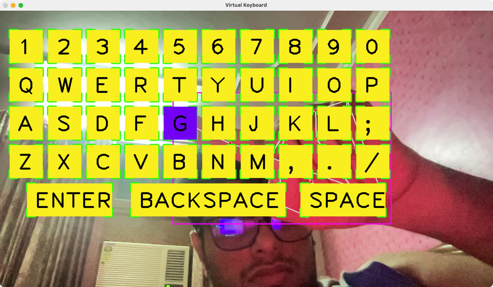

# Virtual Hand Tracking Keyboard

This project implements a virtual keyboard that utilizes hand tracking to detect user input. By leveraging the OpenCV, CVZone, and MediaPipe libraries, the system detects a user's hand and tracks the position of their fingers. Based on finger movement and positioning, it simulates keyboard inputs. The virtual keyboard contains both alphanumeric keys and special keys such as "Enter", "Space", and "Backspace."

## Table of Contents

1. [Demo](#demo)
2. [Requirements](#requirements)
3. [Installation](#installation)
4. [How It Works](#how-it-works)
5. [Code Explanation](#code-explanation)
6. [Usage](#usage)
7. [Notes](#notes)

## Demo



## Requirements

- Python 3.x
- OpenCV (`cv2`)
- CVZone (`cvzone`)
- MediaPipe (`mediapipe`)
- Pynput (`pynput`)
- NumPy (`numpy`)

## Installation

To run this project, follow the steps below:

1. Clone this repository
2. Install the required libraries by running one of the following commands:

    ```bash
    pip install -r requirements.txt
    ```
    OR
    
    ```bash
    pip install opencv-python cvzone mediapipe pynput numpy
    ```

## How It Works

This project leverages a combination of hand tracking and virtual keyboard interfaces:

- **Hand Tracking**: Hand tracking is implemented using the `HandDetector` class from the `cvzone.HandTrackingModule`, which internally uses `mediapipe` for detecting hand landmarks.
- **Virtual Keyboard**: A virtual keyboard layout is defined using an array of keys. When a user's hand is detected, the system checks whether the index finger is hovering over a key. If the index finger and thumb are brought close together (within a certain distance), the corresponding key is "pressed".
- **Key Input Simulation**: The `pynput` library is used to simulate the key presses, including regular alphanumeric keys and special keys like "Enter", "Space", and "Backspace".

## Code Explanation

### 1. Hand Tracking and Virtual Keyboard Setup

- **Hand Tracking**
  - The hand is tracked using `cvzone.HandTrackingModule.HandDetector`. This module detects the user's hand, landmarks, and bounding boxes with adjustable detection and tracking confidence thresholds.
- **Virtual Keyboard**
  - The virtual keyboard is designed with a 2D array of keys, including letters, numbers, and special keys (Space, Enter, Backspace).
  - The `Button` class helps define the position, size, and text of each virtual key.
  - The keys are drawn on the video feed using the `draw_buttons()` function, which uses OpenCV's drawing functions.

### 2. Key Detection

The system detects whether the index finger (landmark 8) is hovering over a key. When the distance between the index finger and thumb (landmark 4) is small, it simulates a key press using `pynput`.

### 3. Key Press Simulation

The `pynput` library is used to simulate actual key presses on the system. This includes alphanumeric keys and special keys (Space, Enter, Backspace).

### 4. Main Loop

The main loop continuously captures frames from the camera and processes them. The hand is detected, keys are drawn, and key press events are simulated based on hand positions.

## Usage

1. Ensure your webcam is functional and connected.
2. Run the Python script:

    ```bash
    python main.py
    ```

3. A virtual keyboard will appear in a window. Move your hand in front of the camera, and use your index finger to hover over the keys.
4. Simulate a key press by bringing your thumb and index finger together. The pressed key will be typed on your system.

### Key Features

- Alphanumeric keys.
- Special keys like "Enter", "Space", and "Backspace".
- Hand detection and key simulation using finger positions.

## Notes

- This system works best in well-lit environments where the camera can easily detect the hand.
- The system uses index and thumb pinch detection for simulating key presses.
- The detection confidence can be adjusted in the `HandDetector` instantiation (`detectionCon` and `minTrackCon`).
- The code assumes a camera feed with a resolution of 1080x520. You can adjust this in the `cv2.VideoCapture()` settings.

## LICENSE

This project is licensed under the MIT License - see the [LICENSE](LICENSE) file for details.